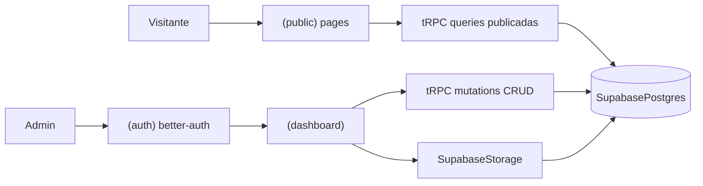

# Arquitetura — CIA VAMU

Padrão inspirado no MeetAI: App Router com route groups, domínio em `modules/`, páginas finas.  
Backend: **Supabase Postgres + Storage**, **better-auth**, **Drizzle**, **tRPC**.

## Árvore sugerida

```
src/
  app/
    (public)/          # site público (home, quem-somos, contato, albuns, agenda)
    (auth)/            # sign-in (better-auth)
    (dashboard)/       # admin autenticado
    api/               # auth (better-auth) + trpc
    layout.tsx
    globals.css
  modules/
    home/
    about/             # quem somos
    contact/
    albums/            # álbuns + fotos (+ upload Supabase Storage)
    events/            # agenda
    auth/              # UI e helpers better-auth
    dashboard/
    # products/        # placeholder futuro (e-commerce)
  components/          # UI compartilhada + shadcn em components/ui
  db/                  # schema + client Drizzle (DATABASE_URL Supabase)
  trpc/                # init, routers, client
  lib/                 # auth (better-auth), supabase (Storage), utils
  messages/            # pt-BR.json (e en.json se incluir i18n)
  i18n/                # request config next-intl (cookie locale, pt-BR padrão)
```

## Padrão por módulo

```
modules/<domínio>/
  ui/views/            # views da página
  ui/components/       # componentes do domínio
  server/procedures.ts # routers tRPC
  schema.ts            # Zod
  types.ts             # tipos inferidos / do domínio
  hooks/               # filtros (nuqs), etc. quando necessário
```

## Regras

- Páginas em `app/` **só orquestram** (Suspense, prefetch tRPC, ErrorBoundary).  
- Lógica de UI e dados fica nas **views** dos modules.  
- Procedures tRPC em `server/procedures.ts`; registrar em `trpc/routers/_app.ts`.  
- Validação de input com Zod nos schemas do módulo.  
- Auth admin: **better-auth**; procedures protegidas checam sessão.  
- Upload de imagens: **Supabase Storage** no server (após auth better-auth).  

## Fluxo público vs admin



## Route groups

| Group | Uso |
|-------|-----|
| `(public)` | Layout com nav/footer do site |
| `(auth)` | Layout mínimo de login (better-auth) |
| `(dashboard)` | Sidebar admin, sessão obrigatória |

## Referência MeetAI

Manter o mesmo “jeito” de organizar modules/UI/tRPC/auth do MeetAI (`better-auth`), com domínios `events`, `albums`, `contact`, `about`.  
Postgres e arquivos no **Supabase** (não Neon). Não copiar `call`, `premium`, agents de IA ou Stream.
