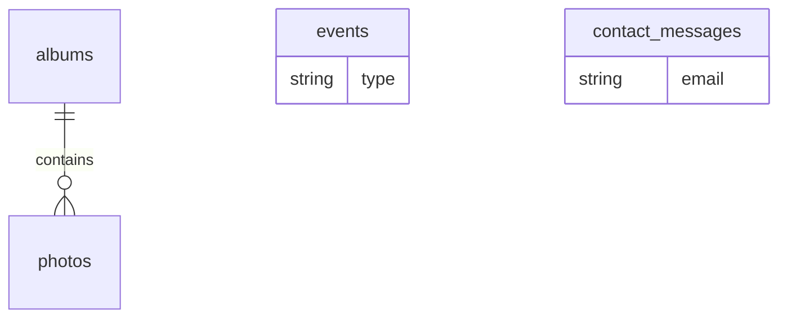

# Dados — CIA VAMU

Schema de domínio com **Drizzle** no **Postgres do Supabase**.  
Auth de usuários/sessão via **better-auth** (tabelas conforme o adapter; mesmo `DATABASE_URL`).  
Imagens via **Supabase Storage**; no domínio guardar URL ou path.

## Entidades do domínio (Drizzle)

### `albums`

| Campo | Tipo | Notas |
|-------|------|--------|
| id | text/uuid | PK |
| title | text | obrigatório |
| description | text | opcional |
| coverImageUrl | text | URL pública (Storage) ou path no bucket |
| published | boolean | default false |
| publishedAt | timestamp | opcional |
| createdAt | timestamp | |
| updatedAt | timestamp | |

### `photos`

| Campo | Tipo | Notas |
|-------|------|--------|
| id | text/uuid | PK |
| albumId | FK → albums | cascade delete |
| imageUrl | text | URL pública (Storage) ou path |
| storagePath | text | opcional — path no bucket para delete/update |
| caption | text | opcional |
| sortOrder | integer | ordenação no álbum |
| createdAt | timestamp | |

### `events`

| Campo | Tipo | Notas |
|-------|------|--------|
| id | text/uuid | PK |
| title | text | |
| description | text | |
| type | enum | `teatro` \| `viagem` \| `evangelismo` \| `outro` |
| startsAt | timestamp | |
| endsAt | timestamp | opcional |
| location | text | opcional |
| published | boolean | |
| createdAt | timestamp | |
| updatedAt | timestamp | |

### `contact_messages` (recomendado no MVP)

| Campo | Tipo | Notas |
|-------|------|--------|
| id | text/uuid | PK |
| name | text | |
| email | text | |
| message | text | |
| createdAt | timestamp | |
| readAt | timestamp | opcional (admin) |

## Mídia (imagens)

- **MVP:** upload no admin para bucket Supabase (ex. `albums`); salvar `imageUrl` / `coverImageUrl` (e `storagePath` se útil).  
- Políticas Storage: leitura pública das imagens dos álbuns publicados; escrita preferencialmente via **service role no server** (procedures tRPC autenticadas com better-auth).  
- URL externa pode existir como fallback, mas o fluxo principal é Storage.  

## Auth

- **better-auth** (padrão MeetAI) apontando para o mesmo Postgres do Supabase.  
- Proteger rotas `(dashboard)` com sessão better-auth.  
- Procedures tRPC admin: validar sessão better-auth antes de mutar / fazer upload.

## Relações

## Placeholder futuro

Módulo `products` / tabelas de catálogo e pedidos **não** entram no schema do MVP. Só reservar pasta/comentário na arquitetura.
